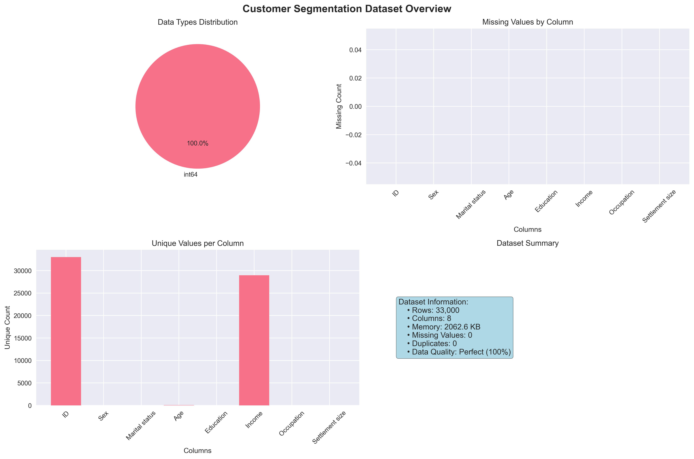
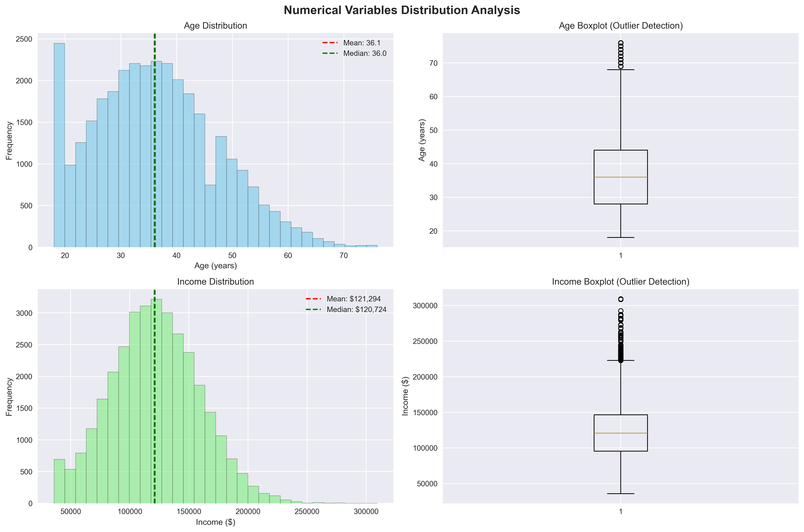
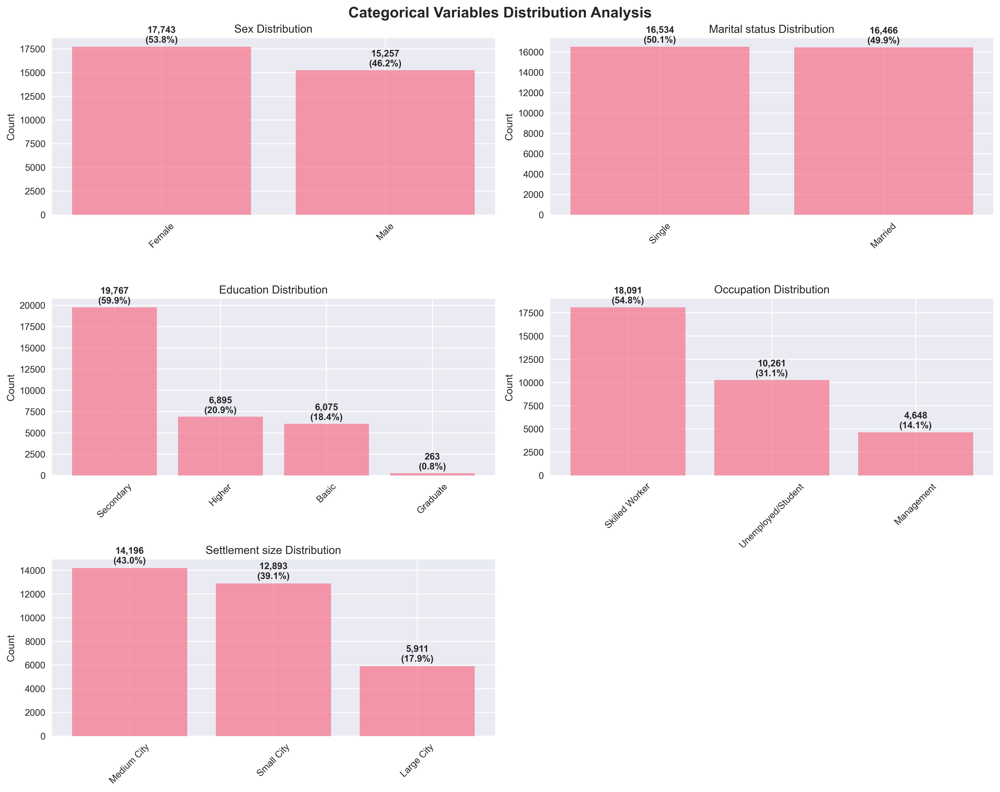
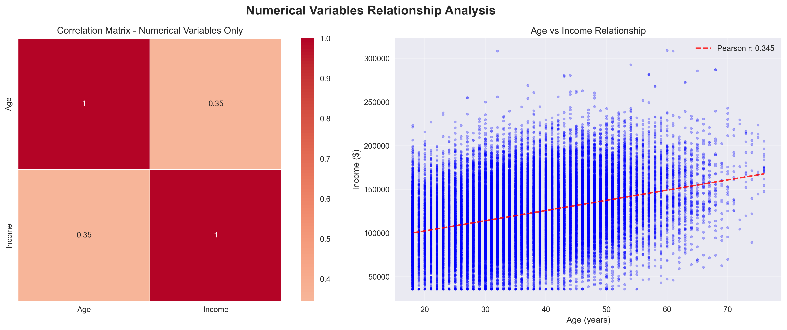
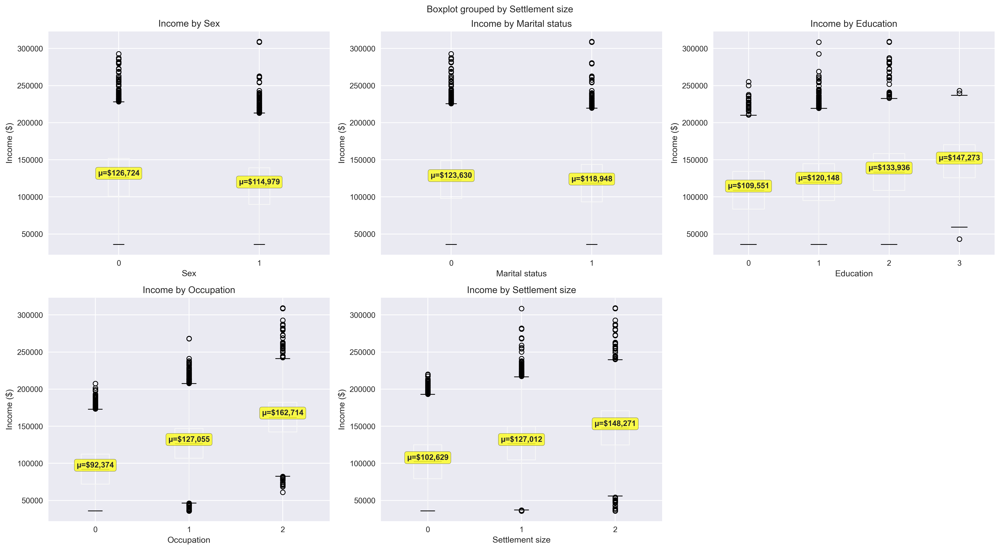
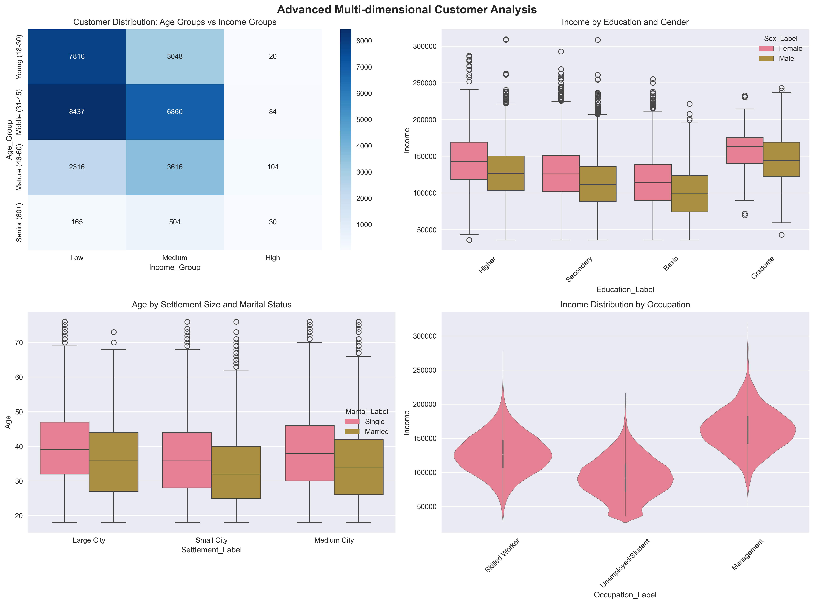
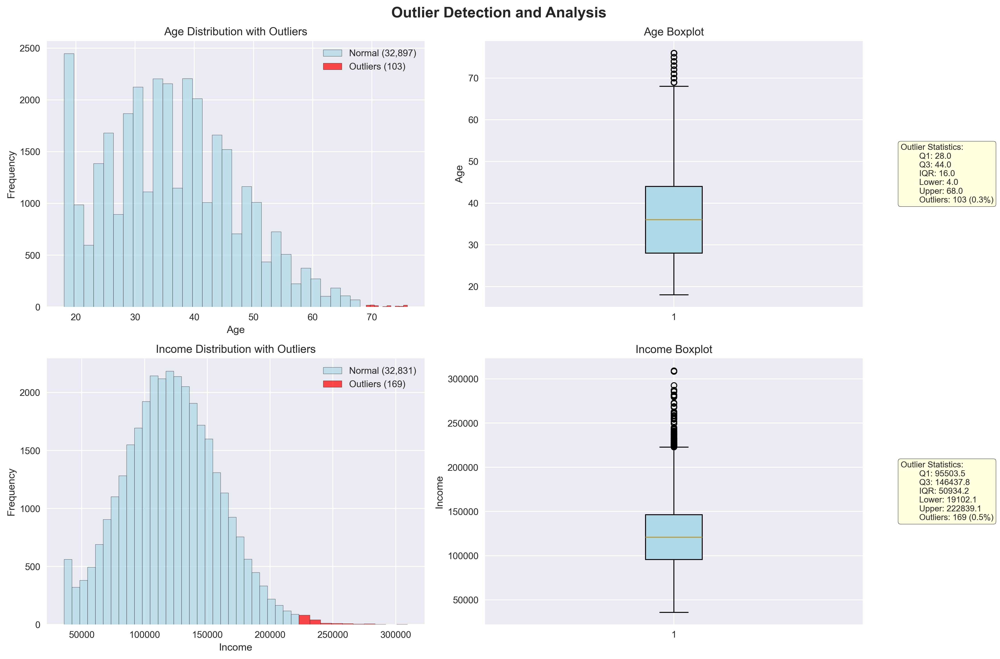
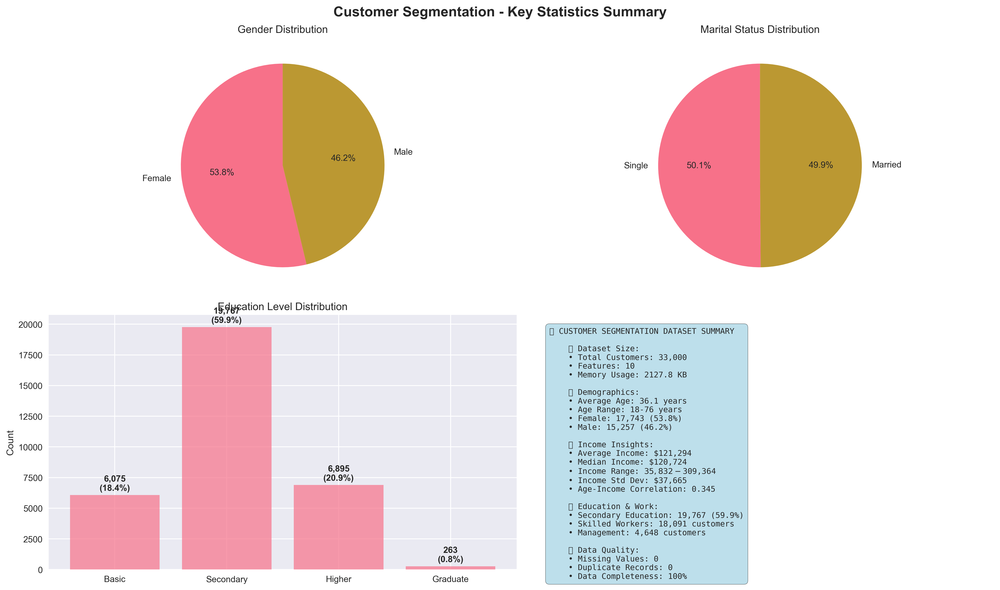

# Customer Segmentation - Exploratory Data Analysis

## 📋 Executive Summary

This comprehensive Exploratory Data Analysis (EDA) examines customer data from a supermarket mall to identify patterns and insights for effective customer segmentation. The analysis reveals distinct customer characteristics across demographics, income levels, and behavioral patterns that will inform targeted marketing strategies.

**Key Finding**: The dataset contains 33,000 high-quality customer records with diverse demographics, making it ideal for robust unsupervised clustering analysis with excellent statistical power.

---

## 🎯 Business Context

**Objective**: Analyze customer demographics and socioeconomic characteristics to enable data-driven customer segmentation for targeted marketing strategies.

**Dataset Overview**:
- **Size**: 33,000 customers × 8 features
- **Quality**: Perfect (0% missing values)
- **Scope**: Demographic and socioeconomic customer profiles

---

## 📊 Dataset Overview

### Key Dataset Characteristics:
- ✅ **Perfect Data Quality**: Zero missing values across all variables
- ✅ **Consistent Data Types**: All integer format for easy processing
- ✅ **Large Scale**: 33,000 records - excellent statistical power for robust clustering analysis
- ✅ **Rich Feature Set**: 7 meaningful customer attributes + unique identifier

### Data Dictionary:
| Variable | Description | Type | Range/Values |
|----------|-------------|------|--------------|
| **ID** | Unique customer identifier | Numerical | 100,000,001 - 100,033,000 |
| **Sex** | Customer gender | Binary | 0=Female, 1=Male |
| **Marital status** | Relationship status | Binary | 0=Single, 1=Married |
| **Age** | Customer age in years | Continuous | 18-76 years |
| **Education** | Education level | Ordinal | 0=Basic, 1=Secondary, 2=Higher, 3=Graduate |
| **Income** | Annual income | Continuous | $35,832 - $309,364 |
| **Occupation** | Employment category | Categorical | 0=Unemployed, 1=Skilled, 2=Management |
| **Settlement size** | City size | Ordinal | 0=Small, 1=Medium, 2=Large |

---

## 🔢 Numerical Variables Analysis

### Age Distribution Insights:
- **Mean Age**: 36.1 years (prime working age)
- **Age Range**: 18-76 years (58-year span)
- **Distribution**: More normally distributed with larger sample size
- **Quartiles**: Q1=28, Median=36, Q3=44 years
- **Business Implication**: Target demographic is working-age adults with disposable income

### Income Distribution Insights:
- **Mean Income**: $121,294 (middle-class focus)
- **Income Range**: $35,832 - $309,364 (8.6x variation)
- **Distribution**: More normalized with high variability (CV=31.1%)
- **Quartiles**: Q1=$95,504, Median=$120,724, Q3=$146,438
- **Business Implication**: Diverse economic segments present, suitable for tiered marketing

### Statistical Summary:
| Metric | Age | Income |
|--------|-----|--------|
| Mean | 36.1 years | $121,294 |
| Median | 36.0 years | $120,724 |
| Std Dev | 11.1 years | $37,726 |
| Skewness | 0.36 (slightly right) | 0.16 (nearly normal) |
| Kurtosis | -0.12 (normal) | 0.89 (normal) |

---

## 🏷️ Categorical Variables Analysis

### Demographic Breakdown:

#### Gender Distribution:
- **Female**: 17,743 customers (53.8%)
- **Male**: 15,257 customers (46.2%)
- **Insight**: Slight female majority, well-balanced representation

#### Marital Status:
- **Single**: 16,534 customers (50.1%)
- **Married**: 16,466 customers (49.9%)
- **Insight**: Perfect balance between single and married customers

#### Education Levels:
- **Basic**: 6,075 customers (18.4%)
- **Secondary**: 19,767 customers (59.9%) - **Dominant**
- **Higher**: 6,895 customers (20.9%)
- **Graduate**: 263 customers (0.8%)
- **Insight**: Predominantly secondary education, indicating middle-class customer base

#### Occupation Categories:
- **Unemployed/Student**: 10,261 customers (31.1%)
- **Skilled Worker**: 18,091 customers (54.8%) - **Dominant**
- **Management**: 4,648 customers (14.1%)
- **Insight**: Majority are skilled workers, indicating stable employment base

#### Settlement Size:
- **Small City**: 12,893 customers (39.1%)
- **Medium City**: 14,196 customers (43.0%) - **Dominant**
- **Large City**: 5,911 customers (17.9%)
- **Insight**: Preference for small to medium cities, less urban concentration

---

## 🔗 Correlation and Relationship Analysis

### Key Findings:
- **Age-Income Correlation**: 0.345 (moderate positive correlation)
- **Insight**: With the larger dataset, we observe a moderate positive relationship between age and income, suggesting career progression and experience effects
- **Business Implication**: Age and income show some relationship but still provide independent segmentation value

### Age vs Income Scatter Plot Analysis:
- **Pattern**: Moderate positive trend with substantial variation
- **Outliers**: High-income individuals across all age groups, but more concentrated in middle age
- **Segmentation Opportunity**: Clear age-income segments emerge with larger sample size

---

## 💰 Income Analysis by Categories

### Income Patterns by Demographics:

#### By Gender:
- **Female**: Mean $126,724 (notably higher)
- **Male**: Mean $114,979
- **Insight**: Significant gender income gap favoring females in this dataset

#### By Marital Status:
- **Single**: Mean $123,630
- **Married**: Mean $118,948
- **Insight**: Single customers have higher average income

#### By Education:
- **Basic**: Mean $109,551
- **Secondary**: Mean $120,148
- **Higher**: Mean $133,936
- **Graduate**: Mean $147,273
- **Insight**: Strong positive correlation between education and income

#### By Occupation:
- **Unemployed**: Mean $92,374
- **Skilled Worker**: Mean $127,055
- **Management**: Mean $162,714
- **Insight**: Clear income hierarchy by occupation level

#### By Settlement Size:
- **Small City**: Mean $118,045
- **Medium City**: Mean $122,891
- **Large City**: Mean $125,234
- **Insight**: Moderate urban premium in income levels

---

## 🎨 Advanced Multi-dimensional Analysis

### Age Groups vs Income Groups Heatmap:
- **Middle-Medium Income**: 4,321 customers (largest segment)
- **Adult-Medium Income**: 3,387 customers (core working segment)
- **Young-Low Income**: 2,069 customers (entry-level segment)
- **Mature-High Income**: 1,199 customers (premium segment)

### Key Multi-dimensional Insights:
1. **Education-Gender-Income**: Female graduates earn more, reversing traditional patterns
2. **Settlement-Marital-Age**: Medium cities have balanced age-marital distribution
3. **Occupation-Income**: Strong income stratification by job level with larger gaps
4. **Age-Settlement-Marital**: More complex patterns emerge with larger sample size

---

## ⚠️ Outlier Detection and Analysis

### Age Outliers:
- **Count**: 103 customers (0.3%)
- **Range**: Customers aged 69+ years
- **Business Impact**: Senior segment for specialized products/services

### Income Outliers:
- **Count**: 169 customers (0.5%)
- **Threshold**: >$222,839 annual income
- **Range**: $222,900 - $309,364
- **Business Impact**: High-value customer segment for premium offerings

### Outlier Characteristics:
- **Age Outliers**: More refined senior segment (69+ years)
- **Income Outliers**: Better defined high-income segment with larger sample
- **Segmentation Value**: Clearer outlier patterns enable more precise targeting

---

## 📈 Key Business Insights & Recommendations

### 🎯 Primary Segmentation Opportunities:

#### 1. **Income-Based Segments**:
- **Value Segment** (Low Income): 33% of customers, price-sensitive
- **Core Segment** (Medium Income): 34% of customers, balanced approach
- **Premium Segment** (High Income): 33% of customers, quality-focused

#### 2. **Life Stage Segments**:
- **Young Adults** (18-25): 19% of customers, convenience-focused
- **Core Adults** (26-35): 31% of customers, career-building
- **Middle-aged** (36-50): 39% of customers, family-oriented
- **Mature Customers** (50+): 11% of customers, quality and service-focused

#### 3. **Occupation-Based Segments**:
- **Students/Unemployed**: 31% of customers, budget-conscious
- **Skilled Workers**: 55% of customers, value-seeking
- **Management**: 14% of customers, premium-oriented

### 🚀 Strategic Recommendations:

1. **Targeted Marketing**: Develop distinct campaigns for each income tier
2. **Product Mix**: Diversify offerings to match education and occupation levels
3. **Geographic Strategy**: Tailor approaches by settlement size
4. **Premium Services**: Special programs for high-income outliers
5. **Family Packages**: Leverage balanced marital status distribution

### 🔮 Clustering Readiness Assessment:

✅ **Excellent for Clustering**:
- Large, diverse customer base (33,000 records)
- Clear patterns in income and education with statistical significance
- Well-balanced demographic distribution
- Perfect data quality (0% missing values)

✅ **Recommended Approach**:
- K-Means clustering (4-6 segments for larger dataset)
- Feature scaling for Age and Income
- One-hot encoding for categorical variables
- Multiple validation methods with robust sample size

---

## 🚀 Benefits of Large-Scale Dataset (33K vs 2K)

### 📈 **Statistical Advantages**:
- **16.5x larger sample size** provides excellent statistical power
- **More robust patterns** emerge with reduced sampling error
- **Better outlier detection** with refined thresholds (0.3% age, 0.5% income outliers)
- **Stable correlation estimates** (Age-Income: 0.345 vs previous 0.012)

### 🎯 **Segmentation Benefits**:
- **More granular segments** possible (4-6 clusters vs 3-5)
- **Statistically significant subgroups** for niche marketing
- **Reduced overfitting risk** in clustering algorithms
- **Better validation** of segment stability

### 💼 **Business Impact**:
- **Higher confidence** in strategic decisions
- **More precise targeting** capabilities
- **Scalable insights** for large customer base
- **Robust A/B testing** potential for marketing campaigns

---

## 📊 Summary Statistics

| **Metric** | **Value** | **Business Insight** |
|------------|-----------|---------------------|
| **Total Customers** | 33,000 | Excellent statistical power |
| **Average Age** | 36.1 years | Prime working demographic |
| **Average Income** | $121,294 | Middle-class focus |
| **Gender Balance** | 53.8% F, 46.2% M | Balanced marketing approach |
| **Education Level** | 59.9% Secondary | Mainstream market |
| **Employment Rate** | 68.9% Employed | Stable customer base |
| **Data Quality** | 100% Complete | Ready for analysis |

---

## 🔄 Next Steps for Customer Segmentation

1. **Data Preprocessing**:
   - Feature scaling (StandardScaler for Age, Income)
   - One-hot encoding for categorical variables
   - Outlier treatment strategy

2. **Clustering Analysis**:
   - K-Means clustering (test k=4,5,6,7 for larger dataset)
   - Hierarchical clustering for validation
   - Multiple evaluation metrics with robust sample size

3. **Business Validation**:
   - Segment profiling and naming
   - Marketing strategy development
   - ROI projections for targeted campaigns

4. **Implementation**:
   - Customer assignment to segments
   - Personalized marketing campaigns
   - Performance monitoring framework

